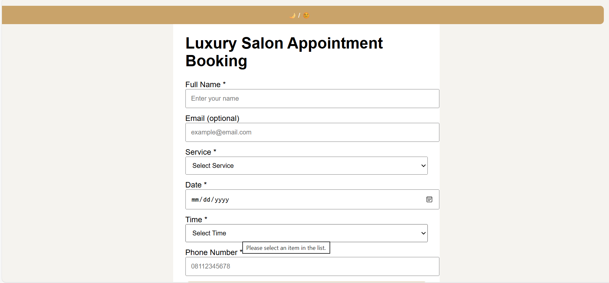
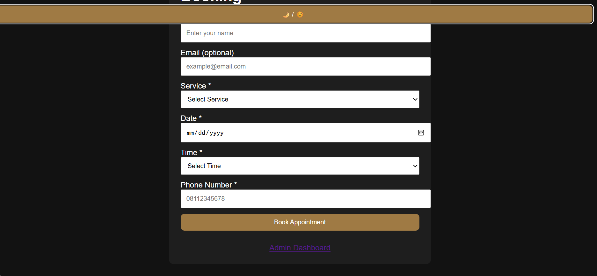
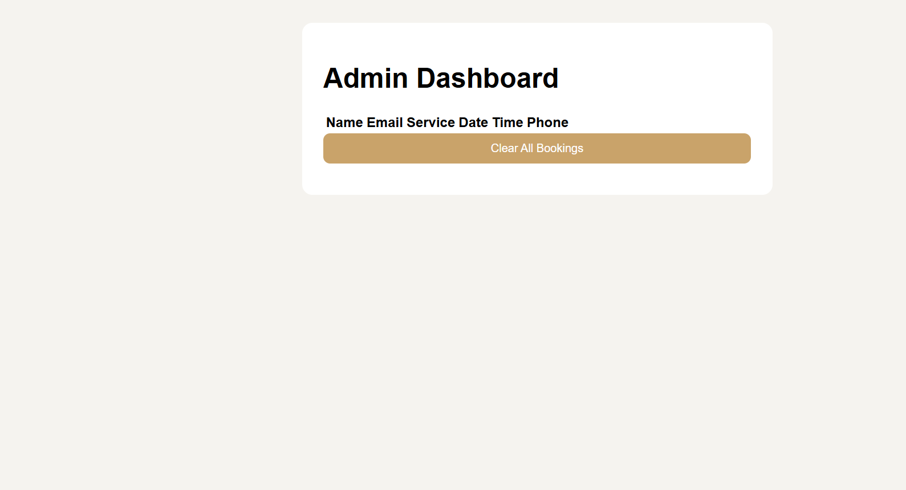

# Salon Appointment Booking Web App
The app allows customers to book salon services, receive WhatsApp confirmation, and enables admins to manage appointments through a simple dashboard.

## 📸 Screenshots
### 🌞 Dashboard - Light Mode

### 🌙 Dashboard - Dark Mode

### Admin Dashboard

## 🔥 Features
### 👩‍💼 Customer Side

Select service with pricing

Choose date & time

Enter name (required), phone (required), email (optional)

WhatsApp confirmation after booking

Dark / Light mode toggle

Mobile-friendly, clean UI

### 🧑‍💻 Admin Side

View all bookings in a table

See customer details (name, phone, email)

Track services, dates, and times

Clear all bookings (LocalStorage)

### 🛠️ Built With

HTML5 – Structure

CSS3 – Styling & Dark/Light mode

JavaScript (Vanilla) – Logic & interactivity

LocalStorage – Data persistence (no backend)

### ⚙️ How It Works

User fills the booking form

Appointment data is saved in LocalStorage

WhatsApp opens with a pre-filled confirmation message

Admin dashboard reads data from LocalStorage and displays bookings

### 🚀 How to Run the Project

Download or clone the repository

Open index.html in your browser

Make a booking

Open admin.html to view bookings

No installation or backend required.

### 📱 WhatsApp Confirmation

The app automatically generates a WhatsApp message like:

Hello [Customer Name],
Your salon appointment is confirmed.

Service: Haircut - ₦3,000
Date: 2025-01-10
Time: 2:00 PM

Thank you for choosing us 💇‍♀️

### Why This Project Matters

This project demonstrates:

Real-world business logic

Form validation

State management without a backend

UI/UX thinking

Client/Admin separation

Third-party integration (WhatsApp)

Perfect for frontend developer portfolios and internship/junior roles.

### Future Improvements

Admin authentication

Email notifications

Backend (Node.js / Firebase)

Payment integration

React version
